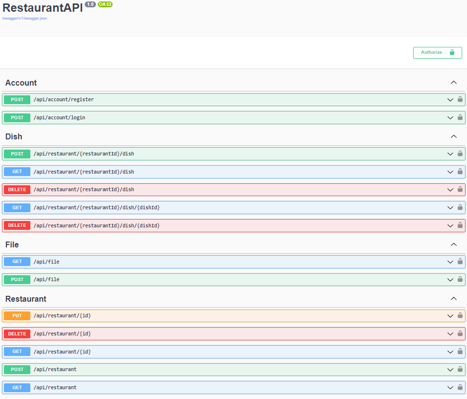

 
<h1>

   Restaurant WebApi 

    
    
    
    
    

  
</h1>

**[GENERAL INFO](#information_source-general-info) • 
[TECHNOLOGIES USED](#hammer_and_wrench-technologies-used) • 
[PACKAGES USED](#packagepackages-used) • 
[FEATURES](#gear-features) • 
[SCREENSHOTS](#camera_flash-screenshots) • 
[SETUP](#rocket-setup) •
[ACKNOWLEDGEMENTS](#handshake-acknowledgements)**

 

# :information_source: General Info
The purpose of the project was to create a web api which enables CRUD (create, read, update, delete) operations for restaurants and their lists of dishes. The program includes user registration and log-in, handling an authentication process by using JWT token (JSON Web Token) in this way. Every user is authorized based on its role or custom policy in order to check its privileges to specific endpoints in the application. Additionally, as a part of the training, downloading a file from the server and sending a file to the server have been implemented in the program.

The project has been created based on practical course on Udemy platform in order to understand the principle of operation of every web application and what elements it consists of. The important aspect of learning was integration of the program with database by using Entity Framework Core.

# :hammer_and_wrench: Technologies Used
- C#
- [ASP.NET Core 7.0](https://github.com/dotnet/aspnetcore)
- [Entity Framework Core 7.0](https://github.com/dotnet/efcore)
- MS SQL Server

# :package:	Packages Used
- [AutoMapper (v12.0.1)](https://github.com/AutoMapper/AutoMapper) -  mapping DTOs (data transfer objects) into domain objects and domain objects into DTOs
- [FluentValidation (v11.3.0)](https://github.com/FluentValidation/FluentValidation) - validating of input during user registration
- [NLog (v5.2.3)](https://github.com/NLog/NLog) - logging of messages to files to have a possibility to debug the application in the production environment
- [Swashbuckle.AspNetCore (v6.5.0)](https://github.com/domaindrivendev/Swashbuckle.AspNetCore/tree/master) - using of swagger tool in order to document the application which is built on ASP.NET Core
- [MicroElements.Swashbuckle.FluentValidation (v5.7.0)](https://github.com/micro-elements/MicroElements.Swashbuckle.FluentValidation) - using of FluentValidation rules instead of ComponentModel attributes to define swagger schema
- [Bogus (v34.0.2)](https://github.com/bchavez/Bogus) - generating of fake data for restaurants and dishes

# :gear: Features
- CRUD operations
  - Restaurants
     - reading a restaurant by using ID (`GET /api/restaurant/{id}`)
     - reading all restaurants (`GET /api/restaurant`)
     - creating a new restaurant (`POST /api/restaurant`)
     - updating a restaurant by using ID (`PUT /api/restaurant/{id}`)
     - deleting a restaurant by using ID (`DELETE /api/restaurant/{id}`)
  - Dishes
     - reading a dish by using ID for specific restaurant (`GET /api/restaurant/{restaurantId}/dish/{dishId}`)
     - reading all dishes for specific restaurant (`GET /api/restaurant/{restaurantId}/dish`)
     - creating a new dish for specific restaurant (`POST /api/restaurant/{restaurantId}/dish`)
     - deleting a dish by using ID for specific restaurant (`DELETE /api/restaurant/{restaurantId}/dish/{dishId}`)
     - deleting all dishes for specific restaurant (`DELETE /api/restaurant/{restaurantId}/dish`)
- User Authentication
   - Account
     - creating a new account (`POST /api/account/register`)
     - logging into account (`POST /api/account/login`)
     - returning a JWT if user login is successful
- User Authorization
   - authorization based on user role
     - access to the endpoint `POST /api/restaurant` for users with roles such as Admin or Manager
   - authorization based on claim value
     - access to the endpoint `GET /api/restaurant/{id}` for users with nationalities such as German, Polish, English
   - custom authorization policy
     - access to the endpoint `DELETE /api/restaurant/{id}` for users who are at least 20 years old
     - access to the endpoint `GET /api/restaurant` for users who created at least 2 restaurants
- Pagination mechanism for the endpoint `GET /api/restaurant` 
- Files handling
   - Files
      - downloading a file from the server (`GET /api/file`)
      - sending a file to the server (`POST /api/file`)
      - response caching for the endpoint `GET /api/file`
         - the cache duration is set on 120 seconds (2 minutes)
         - the server sends a new response when the file name is changed
# :camera_flash: Screenshots

# :rocket: Setup
1. Download the solution using `git clone https://github.com/patrykkaczynski/Restaurant-Web-Api.git` command
2. Enter your database connection string in the ConnectionStrings.RestaurantApi section for appsettings.json file (use MS SQL Server)
3. Install EF Core CLI using `dotnet tool install --global dotnet-ef` command
4. Apply migrations using `dotnet ef database update -s ../RestaurantAPI` command
5. Rebuild and run the application

# :handshake: Acknowledgements
This project has been created based on ASP.NET Core REST Web API course from Udemy platform ([link](https://www.udemy.com/course/praktyczny-kurs-aspnet-core-rest-web-api-od-podstaw/).
